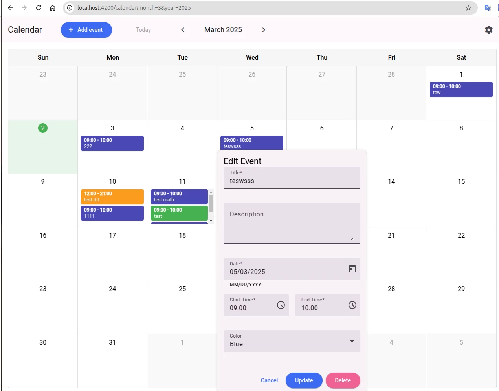
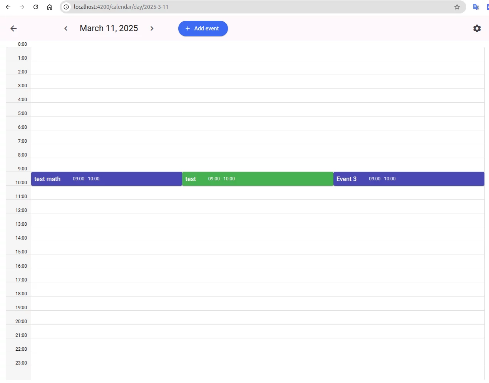
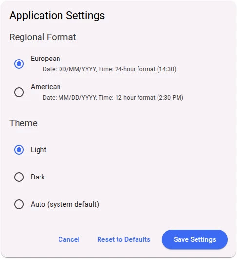

# Simple Calendar Organizer 

### [Example of work](https://oleksandr-kupenko.github.io/calendar-organizer/calendar)

## Stack

1. Angular 19
2. Angular Material

## How to Use

1. Clone the project

   ```bash
   git clone https://github.com/oleksandr-kupenko/calendar-organizer
   ```

2. Install dependencies

   ```bash
   npm i
   ```

3. Start the server

   ```bash
   ng s
   ```

## Application features

1. Add, edit and delete events
2. Move (drag and drop) events between days
3. Open single day for details
4. Set date format and theme

## Screenshots






